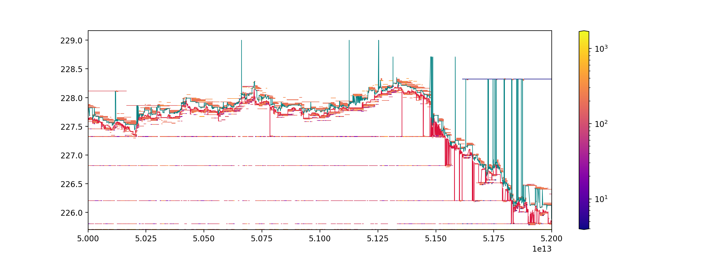

# NASDAQ ITCH 50 Book Constructor
> Given the NASDAQ Total View ITCH 50 data feed, reconstruct the full depth order book and related messages.

This is an efficient c++ implementation of reconstructing a Limit Order Book from data feed messages issued by NASDAQ according the ITCH 50 data protocol specified at <https://www.nasdaqtrader.com/content/technicalsupport/specifications/dataproducts/NQTVITCHSpecification.pdf>. Samples data is publicly available trough NASDAQ public ftp at <ftp://emi.nasdaq.com/ITCH/>. The program will output two csv files containing the messages and related limit order book for the relative stock.

# Folder Structure

```
ITCH
│
└───bin     (c++ executable)
│
└───build   (dipendency and object files)
│
└───data
│   │
│   └───binary      (ITCH binary gzip compressed files from NASDAQ)
│   │
│   └───book        (output of book csv)
│   │
│   └───messages    (output of messages csv)
│   │
│   └───pk          (pickle object files)
│
└───gtests  (.cpp for tests)
│
└───images  (images for README.md Markdown)
│
└───include (.hpp for main program)
│
└───python  (python implementation of some application example)
│
└───src     (.cpp for main program)

```

# Brief Description



This program aims to facilitates research in HFT providing in a handy way the maximum amount of data released by NASDAQ.\
NASDAQ receives orders by traders and market makers, then his matching engine construct the order book, and sells to clients either the data feed composed by messages that can be used to reconstruct the book or directly the reconstructed order book together with visualization tools.\
We used the first one to reconstruct the book. \
Important to notice is that the messages do not coincides with the orders received by NASDAQ, i.e. we do not need a matching engine to match supply and demand, but we are already given the result of the matching engine. Apart from interpreting the binary data according to the specification of the protocol we have to retrieve information of past orders that new messages are referring to.\
We can see this difficulty in the following simple add and delete of an order, according to the specifications the add and delete order would be:

| Message Type | Locate | Tracking | ns since 00:00 | Order id | Buy/Sell | Size | Stock | Price   |
|--------------|--------|----------|----------------|----------|----------|------|-------|---------|
| A            | 8007   | 0        | 28802131792425 | 45785    | B        | 3000 | USO   | 14.7200 |
| ...          |        |          |                |          |          |      |       |         |
| D            | 8007   | 0        | 28802131843697 | 45785    |          |      |       |         |

As we can see once we observe the deletion order no information about the direction, size, stock and price are reported. Hence at each time we have to keep tracks of all the active orders in the book, in order to know what to do one we encounter the deletion order.

The output of the program would be two .csv file withe the following structure:

##### messages of 08/30/2018 PSX AAPL

| time           | type | id    | side | size | price  | cancSize | execSize | oldId | oldSize | oldPrice |
|----------------|------|-------|------|------|--------|----------|----------|-------|---------|----------|
| 29041353544851 | A    | 49816 | 1    | 100  | 223.39 |          |          |       |         |          |
| 29041495720727 | D    | 49816 | 1    | 0    | 223.39 | 100      |          |       |         |          |
| ...            | ...  |       |      |      |        |          |          |       |         |          |

##### book of 08/30/2018 PSX AAPL

| time           | 1_bid_price | 1_bid_vol | 1_ask_price | 1_ask_vol | ... | n_ask_vol |
|----------------|-------------|-----------|-------------|-----------|-----|-----------|
| 29041353544851 |             |           | 223.39      | 100       | ... | ...       |
| 29041495720727 |             |           |             |           |     |           |
| ...            |             |           |             |           |     |           |

## Installation

OS X & Linux:

```sh
git clone https://github.com/martinobdl/ITCH
cd ITCH
make

# to get some data needed to run the program (800 Mb)

wget ftp://anonymous:@emi.nasdaq.com/ITCH/PSX_ITCH/20190327.PSX_ITCH_50.gz -P ./data/binary

# this file exists at date 05/02/2019
# otherwise download manually from the ftp and put the
# .gz file in ITCH/data/binary
```

## Usage example

To reconstruct the book we can use the bash wrapper BookConstructor.sh which has the following usage:

```
usage: ./BookConstructor.sh [-lf] [-n #] data_folder mm/dd/yyyy venue ticker

 -h, --help     Display usage instructions
 -l, --list     Display all the date venues available at data_folder/binary
 -f, --force    To force program execution if output files already exists
 -n,            Number of levels to store for the book, default is 5
```

for example
``` sh
./BookConstructor.sh data_folder mm/dd/yyyy venue ticker -n N
```
will produce two output files named:

```
data_folder/book/mmddyyyy.venue_ITCH50_ticker_book_N.csv
data_folder/messages/mmddyyyy.venue_ITCH50_ticker_message.csv
```

###### example

Given that you have in ```/../../ITCH/data/binary``` the file ```PSX_ITCH/20190327.PSX_ITCH_50.gz```

``` sh
cd /../../ITCH
./BookConstructor.sh ./data 03/27/2019 PSX SPY
```

this will create two output .csv files, namely:
``` sh
/../../ITCH/data/book/03272019.PSX_ITCH50_AAPL_book_5.csv
/../../ITCH/data/messages/03272019.PSX_ITCH50_AAPL_message.csv
```

## Development setup

In the gtest folders there are unit tests in order to test the principal components of the software, they are the Google c++ unittesting libraries. To compile and run the tests you would need the gtests and gmock libraries.
They can be installed in the following way. Refer to <https://github.com/google/googletest/blob/master/googletest/README.md> for more details about the installation.

To install gtest-gmock Ubuntu 18.10
(Ubuntu 18.10 includes gtets and gmock in the default repositories. For past releases this should be done manually)
```sh
# gtests
sudo apt-get install libgtest-dev
sudo apt-get install cmake
cd /usr/src/gtest
sudo cmake CMakeLists.txt
sudo make
sudo cp *.a /usr/lib

#gmock
sudo apt-get install libgmock-dev
cd /usr/src/gmock
sudo mkdir build
sudo cmake ..
sudo make
sudo cp *.a /usr/lib
```

To run the tests:
```sh
cd /../../ITCH
make test
./bin/executeTests
```

## Example Application

In the python folder

* 0.2.1
    * CHANGE: Update docs (module code remains unchanged)
* 0.2.0
    * CHANGE: Remove `setDefaultXYZ()`
    * ADD: Add `init()`
* 0.1.1
    * FIX: Crash when calling `baz()` (Thanks @GenerousContributorName!)
* 0.1.0
    * The first proper release
    * CHANGE: Rename `foo()` to `bar()`
* 0.0.1
    * Work in progress

## Meta

Your Name – [@YourTwitter](https://twitter.com/dbader_org) – YourEmail@example.com

Distributed under the XYZ license. See ``LICENSE`` for more information.

[https://github.com/yourname/github-link](https://github.com/dbader/)

## Contributing

1. Fork it (<https://github.com/yourname/yourproject/fork>)
2. Create your feature branch (`git checkout -b feature/fooBar`)
3. Commit your changes (`git commit -am 'Add some fooBar'`)
4. Push to the branch (`git push origin feature/fooBar`)
5. Create a new Pull Request

<!-- Markdown link & img dfn's -->
[npm-image]: https://img.shields.io/npm/v/datadog-metrics.svg?style=flat-square
[npm-url]: https://npmjs.org/package/datadog-metrics
[npm-downloads]: https://img.shields.io/npm/dm/datadog-metrics.svg?style=flat-square
[travis-image]: https://img.shields.io/travis/dbader/node-datadog-metrics/master.svg?style=flat-square
[travis-url]: https://travis-ci.org/dbader/node-datadog-metrics
[wiki]: https://github.com/yourname/yourproject/wiki

