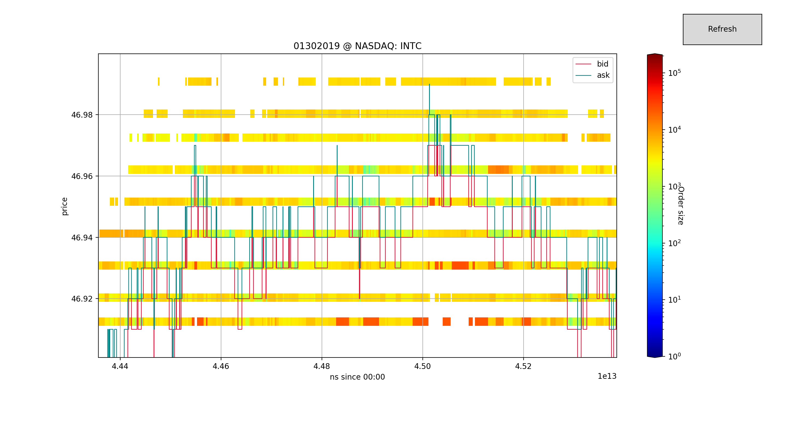
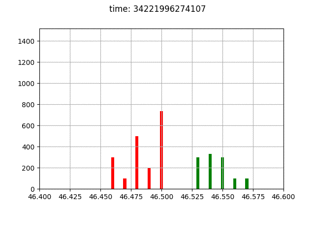

# NASDAQ ITCH 50 Book Constructor
> Given the NASDAQ Total View ITCH 50 data feed, reconstruct the full depth order book and related messages.

This is an efficient c++ implementation of reconstructing a Limit Order Book from data feed messages issued by NASDAQ according to the ITCH 50 data protocol specified at <https://www.nasdaqtrader.com/content/technicalsupport/specifications/dataproducts/NQTVITCHSpecification.pdf>. Some samples data are publicly available trough NASDAQ public ftp at <ftp://emi.nasdaq.com/ITCH/>. The program outputs two csv files containing the messages and the related limit order book for the relative stock.

# Folder Structure

```
ITCH
│
└───bin     (c++ executable)
│
└───build   (dependency and object files)
│
└───doc
│   │
│   └───binary      (LaTex-pdf documentation created with Doxygen)
│
└───data
│   │
│   └───binary      (ITCH binary gzip compressed files from NASDAQ)
│   │
│   └───book        (output of book csv)
│   │
│   └───messages    (output of messages csv)
│   │
│   └───pk          (pickle object files)
│
└───gtests  (.cpp for tests)
│
└───images  (images for README.md Markdown)
│
└───include (.hpp for main program)
│
└───python  (python implementation of some application example)
│
└───src     (.cpp for main program)

```

# Brief Description


This program aims to facilitate research in High Frequency Trading (HFT) providing the maximum amount of data released by NASDAQ, ready for use.\
NASDAQ receives orders by traders and market participants, then its matching engine construct the order book according to specific rules that may depend on the venue, and eventually sells to clients the data feed.\
We were able to reconstruct the book with total depth at about 1Mio-2Mio messages per second, this figure also includes the parsing from the binary data.\
To understand the difficulties of such an exercise is important to understand that the messages do not coincide with the orders received by NASDAQ, i.e. we do not need a matching engine to match supply and demand, but we are already given the result of the matching engine. Apart from interpreting the binary data according to the specification of the protocol we also have to retrieve information of past orders that new messages are referring to.\
We can see this in the following example of a simple add and delete of an order, according to the specifications the add and delete order would be:

| Message Type | Locate | Tracking | ns since 00:00 | Order id | Buy/Sell | Size | Stock | Price   |
|--------------|--------|----------|----------------|----------|----------|------|-------|---------|
| A            | 8007   | 0        | 28802131792425 | 45785    | B        | 3000 | USO   | 14.7200 |
| ...          |        |          |                |          |          |      |       |         |
| D            | 8007   | 0        | 28802131843697 | 45785    |          |      |       |         |

As we can see once we observe the deletion order no information about the direction, size, stock and price are reported. Hence at each time we have to keep track of all the active orders in the book, in order to know what to do once we encounter the deletion order.

The output of the program are two .csv file with the following structure:

##### messages of 08/30/2018 PSX AAPL

| time           | type | id    | side | size | price  | cancSize | execSize | oldId | oldSize | oldPrice |
|----------------|------|-------|------|------|--------|----------|----------|-------|---------|----------|
| 29041353544851 | A    | 49816 | 1    | 100  | 223.39 |          |          |       |         |          |
| 29041495720727 | D    | 49816 | 1    | 0    | 223.39 | 100      |          |       |         |          |
| ...            | ...  |       |      |      |        |          |          |       |         |          |

##### book of 08/30/2018 PSX AAPL

| time           | 1_bid_price | 1_bid_vol | 1_ask_price | 1_ask_vol | ... | n_ask_vol |
|----------------|-------------|-----------|-------------|-----------|-----|-----------|
| 29041353544851 |             |           | 223.39      | 100       | ... | ...       |
| 29041495720727 |             |           |             |           |     |           |
| ...            |             |           |             |           |     |           |

## Installation

OS X & Linux:


```sh
git clone https://github.com/martinobdl/ITCH
cd ITCH
make
```

In order to get some data needed to run the program **(800MB)**
```sh
wget ftp://anonymous:@emi.nasdaq.com/ITCH/PSX_ITCH/20190327.PSX_ITCH_50.gz -P ./data/binary

# this file exists at date 05/02/2019
# otherwise download manually from the ftp and put the
# .gz file in ITCH/data/binary
```

## Usage example

To reconstruct the book we can use the bash wrapper BookConstructor.sh which has the following usage:

```
usage:    ./BookConstructor.sh [-lfh] [-n #] data_folder mm/dd/yyyy venue ticker
          ./BookConstructor.sh [-l] data_folder
          ./BookConstructor.sh [-h]

 -h, --help     Display usage instructions
 -l, --list     Display all the date venues available at data_folder/binary
 -f, --force    To force program execution if output files already exists
 -n,            Number of levels to store for the book, default is 5
```

for example `./BookConstructor.sh data_folder mm/dd/yyyy venue ticker -n N`
will produce two output files named:

```
data_folder/book/mmddyyyy.venue_ITCH50_ticker_book_N.csv
data_folder/messages/mmddyyyy.venue_ITCH50_ticker_message.csv
```

###### example

Given that you have in `/../../ITCH/data/binary` the file `PSX_ITCH/20190327.PSX_ITCH_50.gz`

``` sh
cd /../../ITCH
./BookConstructor.sh ./data 03/27/2019 PSX SPY
```

this will create two output .csv files, namely:
``` sh
/../../ITCH/data/book/03272019.PSX_ITCH50_AAPL_book_5.csv
/../../ITCH/data/messages/03272019.PSX_ITCH50_AAPL_message.csv
```

# Detailed output description

Here we report detailed description of message file output of the program:

At discrete time T1,T2,T3,... an output will be released by NASDAQ, the field names may have different meaning depending on the type of message. Hence here we will give a detailed description of the message csv.

| time | type | id     | side                   | size                                                        | price                                      | cancSize                      | execSize                    | oldId        | oldSize                           | oldPrice                          |
|------|------|--------|------------------------|-------------------------------------------------------------|--------------------------------------------|-------------------------------|-----------------------------|--------------|-----------------------------------|-----------------------------------|
| ...  | A    | ...    | ...                    | added size                                                  | limit price of the add order               | -                             | -                           | -            | -                                 | -                                 |
| ...  | D    | ...    | ...                    | remaining size after the deletion (may be total or partial) | price of the original order                | canceled size by the message | -                           | -            | -                                 | -                                 |
| ...  | E    | ...    | ...                    | remaining size after the execution                          | price of the order being executed          | -                             | size being executed         | -            | -                                 | -                                 |
| ...  | P    | ...    | ...                    | execution of an hidden order                                | price of the execution                     | -                             | size of the hidden eecution | -            | -                                 | -                                 |
| ...  | R    | new id | equal to the old order | new size                                                    | new limit size                             | -                             | -                           | old order id | size of the order being replaced  | price of the order being replaced |
| ...  | C    | ...    | ...                    | remaining size after the execution                          | price at which the order is being executed | -                             | ?                           | -            | -                                 | original price of the order       |


## Development setup

In the gtest folders there are unit tests in order to test the principal components of the software, they are the Google c++ unittesting libraries. To compile and run the tests you would need the gtests and gmock libraries.
They can be installed in the following way. Refer to <https://github.com/google/googletest/blob/master/googletest/README.md> for more details about the installation.

To install gtest-gmock:

```sh
# gtests
sudo apt-get install libgtest-dev
sudo apt-get install cmake
cd /usr/src/gtest
sudo cmake CMakeLists.txt
sudo make
sudo cp *.a /usr/lib

#gmock
sudo apt-get install libgmock-dev
cd /usr/src/gmock
sudo mkdir build
sudo cmake ..
sudo make
sudo cp *.a /usr/lib
```

To run the tests:
```sh
cd /../../ITCH
make test
./bin/executeTests
```

## Application Example

In the python folder there are some examples on how the program might be used to perform research on HFT.\
`environment.py` is the environment definition and `Algo.py` is the agent abstract class from which we would implement the strategy.\
The environment definition provides also some visualization tools.

requirements:
```
python3
numpy
pandas
matplotlib
tkinter
tqdm
```

###### To run the environment visualization tool:

```sh
python3 /../../ITCH/python/environment.py mmddyyyy venue stock
```

###### To run a simple low regret fixed spread strategy:
```sh
python3 /../../ITCH/python/Algo_fixedSpread.py
```

The implemented strategy can be found at

[# 2013] Abernethy, J., Kale, S., Adaptive Market Making via Online Learning.

## Screen shots

### Implementation Class Diagram
> For more details about the API see the documentation in the doc/ folder


### Order Book visualization Tool (from environment.py)



## Contributors

* Luigi Fusco           <https://github.com/luigif9>
* Ozrenka Dragic        <https://github.com/oz-dr>
* Martino Bernasconi    <https://github.com/martinobdl>
